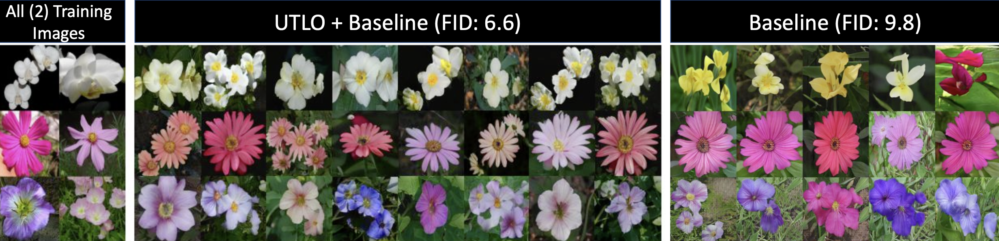

## Taming the Tail in Class-Conditional GANs: Knowledge Sharing via Unconditional Training at Lower Resolutions (UTLO)

### Official PyTorch implementation. Accepted at CVPR 2024.

[Saeed Khorram](https://khorrams.github.io/), [Mingqi Jiang](https://www.linkedin.com/in/mingqi-jiang-23a10423a/), [Mohamad Shahbazi](https://people.ee.ethz.ch/~mshahbazi/), [Mohamad H. Danesh](https://modanesh.github.io/), [Li Fuxin](https://web.engr.oregonstate.edu/~lif/)<br>
Arxiv: https://arxiv.org/abs/2402.17065



## Abstract
*Despite extensive research on training generative adversarial networks (GANs) with limited training data, learning to generate images from long-tailed training distributions remains fairly unexplored. In the presence of imbalanced multi-class training data, GANs tend to favor classes with more samples, leading to the generation of low quality and less diverse samples in tail classes. In this study, we aim to improve the training of class-conditional GANs with long-tailed data. We propose a straightforward yet effective method for knowledge sharing, allowing tail classes to borrow from the rich information from classes with more abundant training data. More concretely, we propose modifications to existing class-conditional GAN architectures to ensure that the lower-resolution layers of the generator are trained entirely unconditionally while reserving class-conditional generation for the higher-resolution layers. Experiments on several long-tail benchmarks and GAN architectures demonstrate a significant improvement over existing methods in both the diversity and fidelity of the generated images. The code is available at https://github.com/khorrams/utlo.*


## Overview
1. [Requirements](#Requirements)
2. [Getting Started](#Start)
   1. [Dataset Preparation](#Data)
   2. [Training](#Train)
   3. [Evaluation and Logging]("Evaluation")
3. [Contact](#Contact)
4. [License](#License)
5. [How to Cite](#How-to-Cite)


## Requirements<a name="Requirements"></a>

* Linux and Windows are supported, but Linux is recommended for performance and compatibility reasons.
* For the batch size of 64, we have used 4 NVIDIA GeForce RTX 2080 Ti GPUs (each having 11 GiB of memory).
* 64-bit Python 3.7 and PyTorch 1.7.1. See [https://pytorch.org/](https://pytorch.org/) for PyTorch installation instructions.
* CUDA toolkit 11.0 or later.  Use at least version 11.1 if running on RTX 3090.  (Why is a separate CUDA toolkit installation required?  See comments of this Github [issue](https://github.com/NVlabs/stylegan2-ada-pytorch/issues/2#issuecomment-779457121).)
* Python libraries: `pip install wandb click requests tqdm pyspng ninja imageio-ffmpeg==0.4.3`.
* This project uses Weights and Biases for visualization and logging. In addition to installing W&B (included in the command above), you need to [create](https://wandb.ai/login?signup=true) a free account on W&B website. Then, you must login to your account in the command line using the command ‍‍‍`wandb login` (The login information will be asked after running the command).
* Docker users: use the [provided Dockerfile](https://github.com/NVlabs/stylegan2-ada-pytorch/blob/main/Dockerfile) by StyleGAN2+ADA (./Dockerfile) to build an image with the required library dependencies.
> Additionally, if you are interested in using newer versions of PyTorch and/or using [miniconda](https://docs.anaconda.com/free/miniconda/miniconda-install/) to install dependencies, use the provided dependency file `req.txt` and simply run `pip install -r req.txt` in your activated virtual environment.

The code relies heavily on custom PyTorch extensions that are compiled on the fly using NVCC. On Windows, the compilation requires Microsoft Visual Studio. We recommend installing [Visual Studio Community Edition](https://visualstudio.microsoft.com/vs/) and adding it into `PATH` using `"C:\Program Files (x86)\Microsoft Visual Studio\<VERSION>\Community\VC\Auxiliary\Build\vcvars64.bat"`.

## Getting Started<a name="Start"></a>

The code for this project is based on the [Pytorch implementation](https://github.com/NVlabs/stylegan2-ada-pytorch) of StyleGAN2+ADA and [transitional-cGAN](https://github.com/mshahbazi72/transitional-cGAN). Please first read their [instructions](https://github.com/NVlabs/stylegan2-ada-pytorch/blob/main/README.md). Here, we mainly provide the additional details required to use our method.

For a quick start, we provide step-by-step instructions on dataset preparation as well as a script to kick off the training for the `AnimalFace` dataset. Note that the scripts do not include the command for activating python environments. Moreover, the paths for the dataset and output directories can be modified in the scripts based on your own setup.

### Dataset Preparation<a name="Data"></a>
Datasets are stored as uncompressed ZIP archives containing uncompressed PNG files and a metadata file `dataset.json` for labels. 

The following command downloads and extracts the `AnimalFace` dataset.
```.bash
wget https://vcla.stat.ucla.edu/people/zhangzhang-si/HiT/AnimalFace.zip
unzip AnimalFace.zip -d ./
rm -rf Image/Natural
rm AnimalFace.zip
```
Custom datasets can be created from a folder containing images (each sub-directory containing images of one class in case of multi-class datasets) using `dataset_tool.py`; Here is an example of how to convert the dataset folder to the desired ZIP file:

```.bash
mkdir datasets
python dataset_tool.py --source=Image/ --dest=datasets/af --transform=center-crop --width=64 --height=64
rm -rf Image/
```
The above example reads the images from the image folder provided by `--src`, resizes the images to the sizes provided by `--width` and `--height`, and applys the transform `center-crop` to them. The resulting images along with the metadata (label information) are stored as a ZIP file determined by `--dest`.

Please see [`python dataset_tool.py --help`](./docs/dataset-tool-help.txt) for more information. See [StyleGAN2+ADA instructions](https://github.com/NVlabs/stylegan2-ada-pytorch/blob/main/README.md#preparing-datasets) for more details on specific datasets or Legacy TFRecords datasets .

The created ZIP file can be passed to the training and evaluation code using `--data` argument.

In order to make imbalanced subset of the data, you can use the `lt_dataset.py` script and run the following:
```.bash
python lt_dataset.py --fn datasets/af/dataset.json --imf 25 --shot-labels --dname animals
```
which generates the imbalanced `lt_25.json` file in the same directory as the `dataset.json`. `imf` is the imabalanced factor. Passing the `--shot-lables` also generates the `many/medium/few-shot` category `.json` files which can be used for few-shot evaluation (see Sec 4.2 in the paper). 

For further detail on the datasets used in the paper see Supp. A.

### Training<a name="Training"></a>

After preparing the dataset, you can run the following command to kick off a training. For the choice of hyperparameters, see Supp. F.  

```.bash
python -W ignore  train.py --outdir=training_runs_af --data=./datasets/af/  \
--fname=lt_25.json --snap=500 --mirror=True --seed=69 --gpus=4 --batch=64 \
--wandb_proj=utlo_af --metrics=fid_shots,kid_shots,fid50k_full,kid50k_full \
--description="example-run-af" --cond=True --add_uc=True --res_uc=8 --alpha=1.0
```

See [StyleGAN2+ADA instructions](https://github.com/NVlabs/stylegan2-ada-pytorch/blob/main/README.md#training-new-networks) for more details on the arguments, configurations amd hyper-parammeters. Please refer to [`python train.py --help`](./docs/train-help.txt) for the full list of arguments.

Note: Our code currently can be used for unconditional, conditional, conditional training with unconditional training at lower resolutions (UTLO).

### Evaluation and Logging<a name="Evaluation"></a>

By default, `train.py` automatically computes FID for each network pickle exported during training. By default, we use `--metrics=fid_shots,kid_shots,fid50k_full,kid50k_full` for the reported scores in the paper. More metrics can be added to the argument `--metrics` (as a comma-seperated list).  To monitor the training, you can inspect the log.txt an JSON files (e.g. `metric-fid50k_full.jsonl` for FID) saved in the ouput directory.  Alternatively, you can inspect WandB or Tensorboard logs (By default, WandB creates the logs under the project name "UTLO", which can be accessed in your account on the website). 

When desired, the automatic computation can be disabled with `--metrics=none` to speed up the training slightly (3%&ndash;9%). Additional metrics can also be computed after the training:

```.bash
# Previous training run: look up options automatically, save result to JSONL file.
python calc_metrics.py --metrics=pr50k3_full \
    --network=~/training-runs/00000-ffhq10k-res64-auto1/network-snapshot-000000.pkl

# Pre-trained network pickle: specify dataset explicitly, print result to stdout.
python calc_metrics.py --metrics=fid50k_full --data=~/datasets/ffhq.zip --mirror=1 \
    --network=https://nvlabs-fi-cdn.nvidia.com/stylegan2-ada-pytorch/pretrained/ffhq.pkl
```

The first example looks up the training configuration and performs the same operation as if `--metrics=pr50k3_full` had been specified during training. The second example downloads a pre-trained network pickle, in which case the values of `--mirror` and `--data` must be specified explicitly.


See [StyleGAN2+ADA instructions](https://github.com/NVlabs/stylegan2-ada-pytorch/blob/main/README.md#quality-metrics) for more details on the available metrics. 

## Contact<a name="Contact"></a>
For any questions, suggestions, or issues with the code, please contact Saeed Khorram at [khorrams@oregonstate.edu](mailto:khorrams@oregonstate.edu)<br>

## License<a name="License"></a>
This repo is built on top of the [StyleGAN2-ADA](https://github.com/NVlabs/stylegan2-ada-pytorch) and [Transitional-cGAN](https://github.com/mshahbazi72/transitional-cGAN). So please refer to and acknowledge their license and terms of use.

## How to Cite<a name="How-to-Cite"></a>

```
@inproceedings{Khorram2023taming,
  title   = {Taming the Tail in Class-Conditional GANs: Knowledge Sharing via Unconditional Training at Lower Resolutions},
  author  = {Saeed Khorram and Mingqi Jiang and Mohamad Shahbazi and Mohamad Hosein Danesh and Li Fuxin},
  year    = {2024},
  url     = {https://openreview.net/pdf?id=I3UzkFb1HB},
  journal = {CVPR}
}
```

